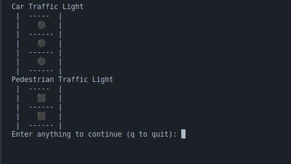
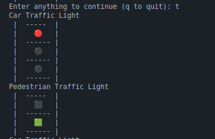
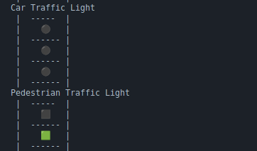
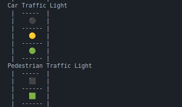
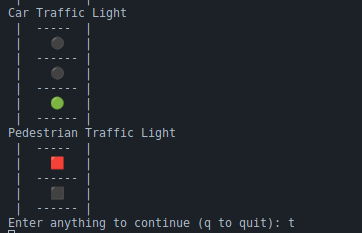

# Street Crossing 

## step 1
- When you start the program the lights are off
- To **``Quit``** press `q` and to **`continue`** with sequence press `any` other `key`.

## step 2
- When you press a button, the cars are stopped and people can now walk

## Step-3
- The lights will start to flash now showing 

## step 4
- Then the People are stopped and cars can now move

